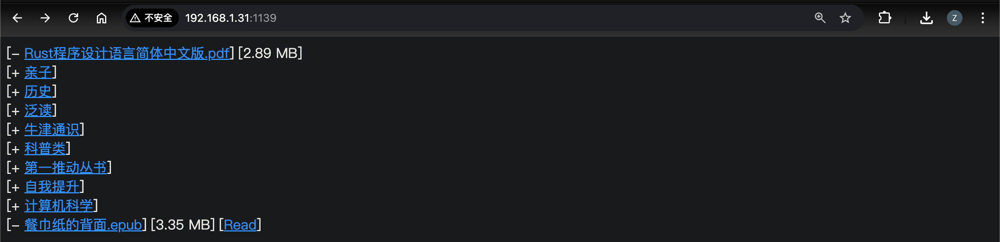
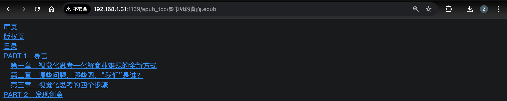

# my-cont-srv
A simple content server for browsing contents in a browser. Currently it supports below features.
- Serving directories and files via HTTP/HTTPS for downloading
- Serving epub files for reading in browser
- TLS(HTTPS) support
- Basic HTTP authentication support
- Content-Type auto guess for viewing pdf, mp4, etc. in browser

## Usage
See `-h` output for basic usage. Use `-c <path>` option to specify a configuration file, which is in toml format. A sample configuration file can be found at <a href="res_dir/config.toml">`res_dir/config.toml`</a>. Optional HTTPS and basic authentication supports are enabled via configuration file instead of command line options. The password needs to be hashed first using `--hash-password` command line option before putting into the configuration file.

## Screenshots
Below are some screenshots of browsing the server using Google Chrome with "Dark Reader" extension.

